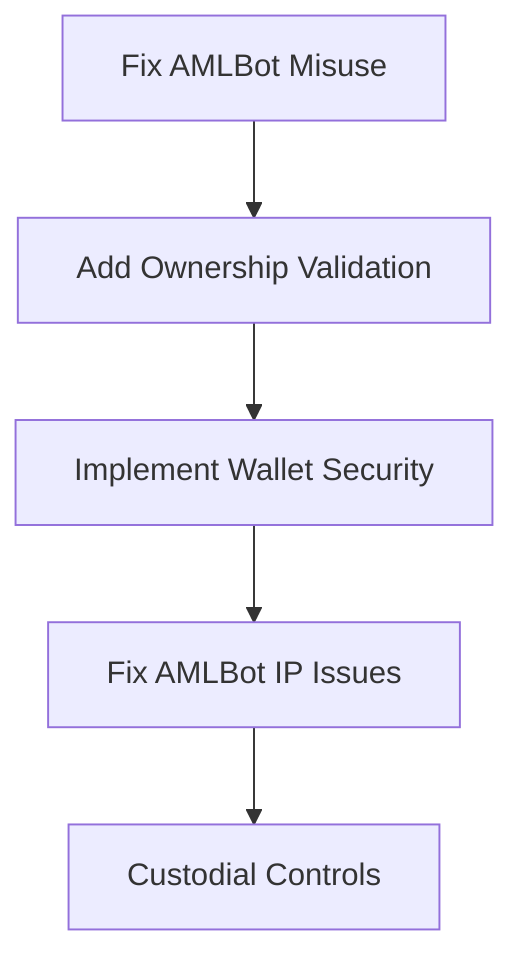
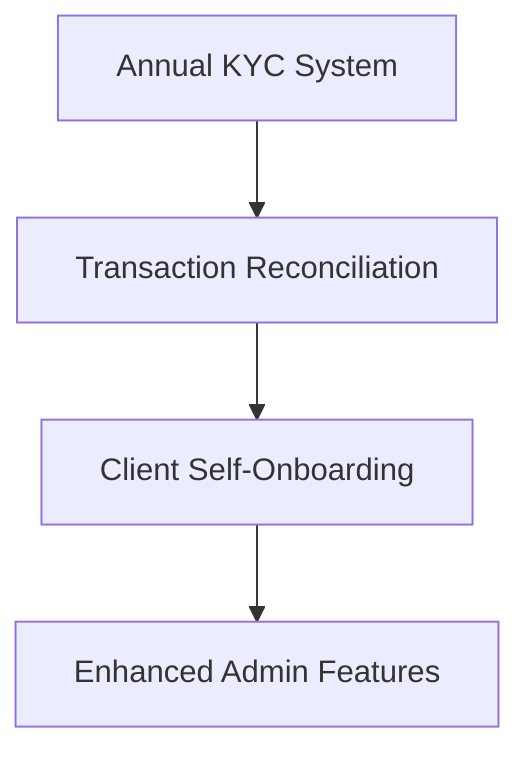
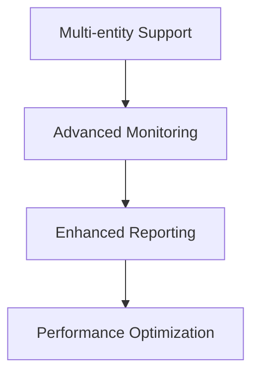

# iTransfr Client Onboarding & Management Documentation

## 📋 Documentation Overview

This documentation suite provides comprehensive analysis and implementation guidance for the iTransfr client onboarding and management system.

---

## 📚 Available Documentation

### Core Analysis Documents

| Document | Purpose | Status |
|----------|---------|--------|
| **[PROJECT_STATUS_SUMMARY.md](PROJECT_STATUS_SUMMARY.md)** | Executive summary of current state and critical issues | ✅ Complete |
| **[CLIENT_ONBOARDING_ANALYSIS.md](CLIENT_ONBOARDING_ANALYSIS.md)** | Detailed technical analysis of codebase and requirements | ✅ Complete |
| **[IMPLEMENTATION_FIXES_GUIDE.md](IMPLEMENTATION_FIXES_GUIDE.md)** | Step-by-step fixes for critical issues | ✅ Complete |

### Original Requirements & Integration Docs

| Document | Purpose | Status |
|----------|---------|--------|
| **[iTransfr_Onboarding_Flow_Guide_v3.md](iTransfr_Onboarding_Flow_Guide_v3.md)** | Business requirements and flow specifications | ✅ Original |
| **[AMLBOT_INTEGRATION.md](AMLBOT_INTEGRATION.md)** | Transaction-level AML integration | ✅ Complete |
| **[AMLBOT_KYC_INTEGRATION.md](AMLBOT_KYC_INTEGRATION.md)** | KYC integration (requires fixes) | ⚠️ Needs Updates |
| **[iTransfr_Onboarding_Implementation_Spec.md](iTransfr_Onboarding_Implementation_Spec.md)** | Technical implementation specs | ✅ Original |

### Testing & Configuration

| Document | Purpose | Status |
|----------|---------|--------|
| **[KYC-AMLBOT.postman_collection.json](KYC-AMLBOT.postman_collection.json)** | API testing collection | ✅ Available |
| **[amlbot-env-sample.txt](amlbot-env-sample.txt)** | Environment configuration | ✅ Template |
| **[Onboarding_Changes_Plan.md](Onboarding_Changes_Plan.md)** | Planned modifications | ✅ Original |

---

## 🚨 Critical Issues - Immediate Action Required

### Top Priority Fixes (Week 1)

| Issue | Severity | Document Reference | Timeline |
|-------|----------|-------------------|----------|
| **Missing Ownership Validation** | 🔴 Critical | [Fixes Guide - Section 1](IMPLEMENTATION_FIXES_GUIDE.md#fix-1-100-ownership-validation) | 2 days |
| **Wallet Security Gaps** | 🔴 Critical | [Fixes Guide - Section 2](IMPLEMENTATION_FIXES_GUIDE.md#fix-2-wallet-security-implementation) | 3 days |
| **AMLBot IP Whitelisting** | 🔴 Critical | [Fixes Guide - Section 3](IMPLEMENTATION_FIXES_GUIDE.md#fix-3-amlbot-ip-whitelisting) | 1 day |
| **Annual KYC System** | 🔴 Critical | [Fixes Guide - Section 4](IMPLEMENTATION_FIXES_GUIDE.md#fix-4-annual-kyc-update-system) | 3 days |

### Quick Start for Critical Fixes

1. **Read** [PROJECT_STATUS_SUMMARY.md](PROJECT_STATUS_SUMMARY.md) for executive overview
2. **Follow** [IMPLEMENTATION_FIXES_GUIDE.md](IMPLEMENTATION_FIXES_GUIDE.md) for step-by-step fixes
3. **Review** [CLIENT_ONBOARDING_ANALYSIS.md](CLIENT_ONBOARDING_ANALYSIS.md) for detailed analysis

---

## 📊 Current System Status

### What Works ✅
- Basic 8-step onboarding flow
- Admin client management UI
- Document upload infrastructure
- Country-specific entity types
- Transaction APIs (deposits/payouts)
- AMLBot integration (both KYC and AML)

### Critical Gaps ❌
- No 100% ownership validation
- Missing wallet security (2FA, whitelisting)
- No annual KYC update automation
- Broken transaction monitoring (IP whitelisting)

### Compliance Status ⚠️
- **Ownership Disclosure**: FAIL (no validation)
- **KYC Automation**: FAIL (no annual updates)
- **Wallet Security**: FAIL (missing controls)
- **Transaction Monitoring**: PARTIAL (AMLBot issues)

---

## 🎯 Implementation Roadmap

### Phase 1A: Critical Security (Week 1)


### Phase 1B: Business Logic (Week 2)


### Phase 2: Advanced Features (Month 2-3)


---

## 🔧 Technical Architecture Overview

### Current Code Structure
```
src/
├── app/api/admin/client/     # Admin client management APIs
├── app/(admin)/admin/clients/ # Admin UI components
├── lib/integrations/         # External service integrations
├── services/                 # Business logic services
└── components/               # Reusable UI components
```

### Key Services Requiring Updates
- **KYC Service**: Separate from AMLBot integration
- **Wallet Security Service**: Add 2FA, whitelisting, custodial controls
- **Ownership Validation Service**: Enforce 100% requirement
- **AML Monitoring Service**: Fix IP whitelisting issues

---

## 🧪 Testing Strategy

### Critical Path Testing
1. **Ownership Validation**: Ensure 100% enforcement
2. **Wallet Security**: 2FA and whitelisting validation
3. **KYC Separation**: AMLBot used only for transactions
4. **Transaction Monitoring**: Webhook functionality

### Integration Testing
- Full onboarding flow with validations
- Admin approval workflows
- Transaction processing with AML checks
- Annual KYC reminder system

---

## 📈 Success Metrics

### By End of Week 2
- ✅ 100% ownership validation enforced
- ✅ AMLBot properly separated (KYC vs transactions)
- ✅ Wallet security fully implemented
- ✅ Transaction monitoring operational
- ✅ Annual KYC automation working

### Long-term Goals
- ✅ 74M+ USD processing with compliance
- ✅ Complex ownership structures supported
- ✅ Multi-jurisdiction compliance maintained

---

## 📞 Support & Resources

### Documentation Navigation
- **New to the project?** Start with [PROJECT_STATUS_SUMMARY.md](PROJECT_STATUS_SUMMARY.md)
- **Need to implement fixes?** Follow [IMPLEMENTATION_FIXES_GUIDE.md](IMPLEMENTATION_FIXES_GUIDE.md)
- **Understanding requirements?** Read [iTransfr_Onboarding_Flow_Guide_v3.md](iTransfr_Onboarding_Flow_Guide_v3.md)

### Key Contacts
- **Technical Issues**: Development team
- **Compliance Questions**: Compliance officer
- **Business Requirements**: Product team

### Version History
- **v1.0** (Dec 29, 2025): Initial analysis and fix documentation
- **Original docs**: Based on meeting notes and codebase examination

---

## 🚀 Quick Actions

### Immediate (Today)
1. **Review ownership submissions** - Check for invalid data
2. **Audit wallet operations** - Identify security gaps
3. **Verify AMLBot integration** - Confirm both KYC and AML functions working

### This Week
1. **Implement ownership validation** - Block invalid submissions
2. **Fix AMLBot configuration** - Enable transaction monitoring
3. **Add basic wallet security** - 2FA framework

### Next Steps
1. **Annual KYC system** - Automated reminders
2. **Client self-onboarding** - Public signup flow
3. **Enhanced monitoring** - Fraud detection

---

*This documentation was created based on a comprehensive analysis of the iTransfr codebase and meeting requirements. Focus on fixing the critical issues before implementing new features.*

**Last Updated:** December 29, 2025
**Next Review:** January 5, 2026 (after Phase 1A completion)
